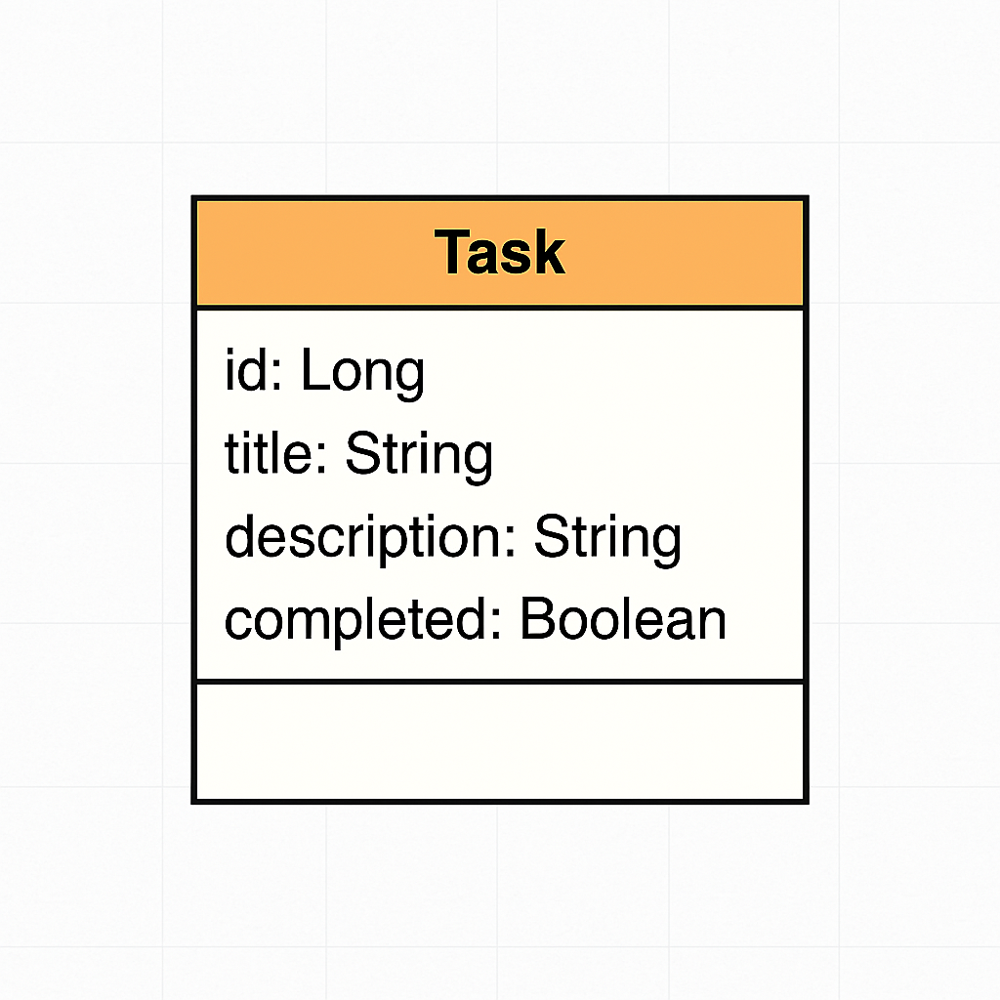
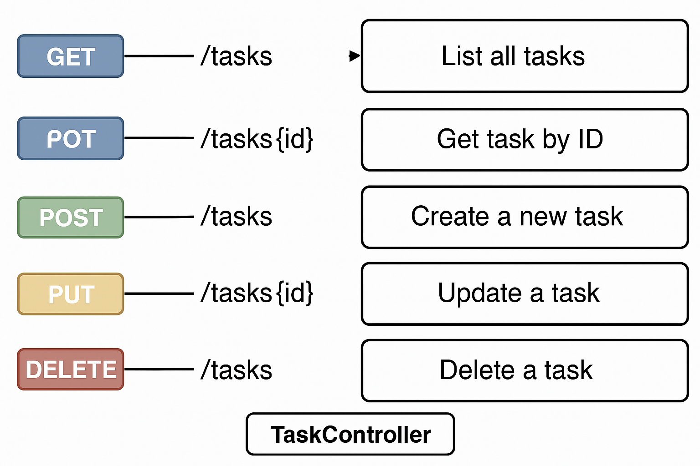

# 📌 API REST de Tarefas

Uma API RESTful desenvolvida com **Spring Boot 3** e **Java 17** para gerenciar tarefas. Com suporte completo a operações CRUD, documentação com Swagger, banco de dados PostgreSQL e deploy no Railway.

---
## 🔗 Link da API em Produção

👉 [https://api-rest-spring-boot-3-production.up.railway.app](https://api-rest-spring-boot-3-production.up.railway.app)

---
## 📚 Documentação Swagger

Acesse a documentação interativa da API:

👉 [https://api-rest-spring-boot-3-production.up.railway.app/swagger-ui.html](https://api-rest-spring-boot-3-production.up.railway.app/swagger-ui.html)

---


## 📦 Funcionalidades

- ✅ Criar tarefas
- ✅ Listar todas as tarefas
- ✅ Buscar tarefa por ID
- ✅ Atualizar uma tarefa existente
- ✅ Remover tarefa

---

## 🛠️ Tecnologias Utilizadas

- **Java 17**
- **Spring Boot 3**
- **Spring Data JPA**
- **PostgreSQL**
- **SpringDoc Swagger UI**
- **Railway (Deploy e Banco de Dados)**
- **Maven**

---

## 📁 Estrutura da API

- `TaskController` – Controller com todos os endpoints da API
- `Task` – Entidade principal com campos `id`, `title`, `description`, `completed`
- `TaskRepository` – Interface JPA para persistência

---

## 🚀 Como Rodar Localmente

### Pré-requisitos

- Java 17
- Maven
- PostgreSQL (ou usar o Railway)

---

### Passos

```bash
# Clone o repositório
git clone https://github.com/WellFl/api-rest-spring-boot-3.git
cd api-rest-spring-boot-3
```
---

# Execute o projeto
./mvnw spring-boot:run

## 📫 Endpoints da API

| Método | Endpoint            | Descrição                            |
|--------|---------------------|----------------------------------------|
| GET    | `/tasks`            | Retorna todas as tarefas               |
| GET    | `/tasks/{id}`       | Retorna uma tarefa pelo ID             |
| POST   | `/tasks`            | Cria uma nova tarefa                   |
| PUT    | `/tasks/{id}`       | Atualiza uma tarefa existente pelo ID  |
| DELETE | `/tasks/{id}`       | Deleta uma tarefa pelo ID              |

---

## 🧪 Testando a API com Postman

Você pode testar todos os endpoints da API utilizando o Postman.

### Sugestão:

1. Abra o Postman
2. Faça requisições para `http://localhost:8080/tasks` utilizando os métodos `GET`, `POST`, `PUT`, `DELETE`
3. Envie um JSON no corpo da requisição ao usar `POST` ou `PUT`. Exemplo:

```json
{
  "title": "Estudar Spring Boot",
  "description": "Assistir aulas e praticar código",
  "completed": false
}
```
---

## 📄 Documentação e Diagramas

Na pasta `/documentacao` você encontrará:

- ✅ **PDF** com a explicação completa do projeto e sua estrutura
- ✅ **Diagrama de Classe (UML)** da entidade `Task`
- ✅ **Diagrama dos Endpoints REST** da API

### 📷 Prévia dos Diagramas

#### 🧩 Diagrama de Classe



#### 🌐 Diagrama de Endpoints




